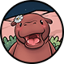

# 一. 如何加入摩登河马

1.注册账号
----------------

使用邮箱注册账号，选择所在国家并完成实名认证。

2.领取免费河马NFT
----------------

完成实名后，免费领取呆萌河马NFT，每日产出10积分的免费河马，产出周期为365天。同时赠送呆萌河马宠物，通过每日喂养升级解锁更多收益。

3.积分兑换为河马币
----------------

   1积分 = 1 MOODENG

   兑换与提现MOODENG

> - 积分兑换MOODENG需消耗1:1活跃度
> - 提现 MOODENG 与 USDT 均收取固定 5% 手续费。
>

4.获取活跃度方式
----------------

> - 邀请1位好友  =  1活跃度  
> - 宠物养成   
> - 河马NFT产出

点击首页【摩登河马】可查看当日收益与累计收益。