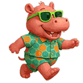

# 三.宠物养成与任务系统

1.如何获得成长值
----------------

> - 宠物河马每日喂食和洗澡+2.5% 成长值；邀请一位好友额外+2.5% 成长值；每张加速卡可加速20%成长值

> - 所有宠物河马成长值都为100%，当宠物喂养进度满值后，可解锁喂养下一级新宠物河马（宠物只能拥有一只）。

> - 每日完成喂养宠物可领取分红奖励（积分，活跃度，MOODENG币）。

2.宠物升级
----------------

>  宠物河马完成升级后，还可获得NFT加成 TAP 奖励 （TAP收益：您的NFT收益额外增加百分1%-15%）

3.宠物加速卡
----------------

> 喂养宠物可使用加速卡进行养成加速，每张加速卡增加20%喂养进度。 &nbsp;&nbsp;&nbsp;&nbsp;&nbsp;&nbsp;&nbsp;&nbsp;&nbsp;&nbsp;&nbsp;&nbsp;&nbsp;&nbsp;&nbsp;&nbsp;  

4.宠物详情
----------------

|   宠物   | 兑换手续费 |     每日收益    | TAP |
| :----: | :---: | :---------: | :-: |
|  呆萌河马  |  50%  |     3积分     |  0% |
|  吃瓜河马  |  40%  |   8积分 1活跃度  |  1% |
|  嘟嘴河马  |  30%  |  15积分 3活跃度  |  2% |
|  冲浪河马  |  20%  |  20积分 8活跃度  |  4% |
|  黑帮河马  |  10%  |   5M 20活跃度  |  6% |
|  战士河马  |   0   |  10M 50活跃度  |  8% |
|  机甲河马  |   0   |  20M 100活跃度 | 10% |
|  星际河马  |   0   |  50M 150活跃度 | 12% |
| 宇宙霸主河马 |   0   | 100M 200活跃度 | 15% |

5.【任务系统】
----------------

🧩完成指定任务可额外获得 MOODENG 奖励以及河马NFT碎片。碎片可合成更高等级 NFT（无数量上限）。

|  任务 |     详情    |     奖励    |
| :-: | :-------: | :-------: |
|  1  |   邀请3位好友  |   2M-10M  |
|  2  |  邀请10位好友  |  1个NFT碎片  |
|  3  |  邀请30位好友  |  3个NFT碎片  |
|  4  |  升级至吃瓜河马  |  5个NFT碎片  |
|  5  |  升级至嘟嘴河马  |  15个NFT碎片 |
|  6  |  升级至冲浪河马  |  25个NFT碎片 |
|  7  |  升级至黑帮河马  |  50个NFT碎片 |
|  8  |  升级至机甲河马  | 100个NFT碎片 |
|  9  | 升级至宇宙霸主河马 | 200个NFT碎片 |
