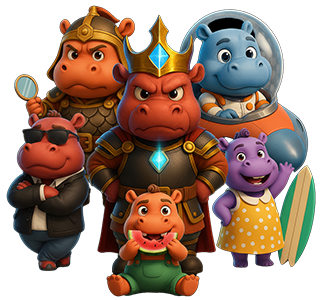

# 四.团队系统

1.团队收益来源
----------------

👥点击【团队】查看、领取团队收益以及好友贡献↓

> 团队收益分为两级：

> - 一级好友最高35%

> - 二级好友最高10%

2.升级团队等级 &nbsp;&nbsp;&nbsp;&nbsp;&nbsp;&nbsp;&nbsp;&nbsp;&nbsp;&nbsp;&nbsp;&nbsp;&nbsp;&nbsp;&nbsp;&nbsp;&nbsp;&nbsp;&nbsp;&nbsp;&nbsp;&nbsp;&nbsp;&nbsp; 
----------------

升级团队等级所需

> - 自己100%
> - 一级好友100%
> - 二级好友30%
> 花费MONDENG购买NFT的总和

计算方式

> 自己按 100% 计入,一级好友按 100% 计入，二级好友按 30% 计入,**三者总和计入等级进度**

> 达成升级条件后升级进度将清零，余下业绩累加进入下一等级升级所需。

每次升级后，可在团队等级后点击【奖励】**领取河马 NFT 奖励**。

| 团队等级 |   升级条件   | 一级收益 | 二级收益 | 达成奖励（NFT） |
| :--: | :------: | :--: | :--: | :-------: |
|  V0  |     0    |  3%  |  1%  |     无     |
|  V1  |   5000M  |  5%  |  2%  |    吃瓜河马   |
|  V2  |  10000M  |  7%  |  2%  |    嘟嘴河马   |
|  V3  |  20000M  |  9%  |  3%  |    冲浪河马   |
|  V4  |  40000M  |  12% |  3%  |    黑帮河马   |
|  V5  |  80000M  |  15% |  4%  |    战士河马   |
|  V6  |  160000M |  20% |  5%  |    机甲河马   |
|  V7  |  320000M |  25% |  6%  |    星际河马   |
|  V8  |  640000M |  30% |  8%  |   宇宙霸主河马  |
|  V9  | 1300000M |  35% |  10% | 宇宙霸主河马\*2 |

3.邀请好友
----------------

> 点击右上角**邀请好友**即可保存邀请二维码和邀请码。

> 邀请新人**需填写邀请码**才能注册加入MOODENG。
